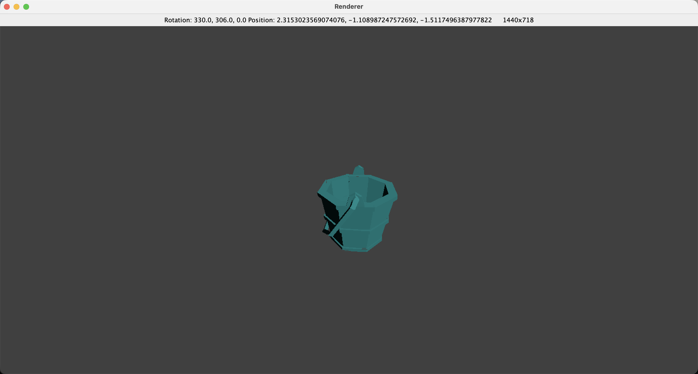

# Java 3D STL Renderer



A lightweight, from-scratch 3D graphics engine built in Java. This project implements the full rendering pipeline—from parsing raw vertex data to projecting 3D coordinates onto a 2D screen—without the use of external 3D libraries like OpenGL.

## Technical Features

* **Custom STL Parser:** A robust parser designed to read and validate ASCII-encoded `.stl` files, extracting vertex triplets and surface normal vectors.
* **Linear Algebra Engine:** Implemented custom matrix transformations to handle translation, rotation (Euler angles), and scaling in 3D space.
* **Backface Culling:** An optimization technique that discards surfaces facing away from the camera. By calculating the dot product between the surface normal and the camera’s view vector, the engine skips the rendering of roughly 50% of the polygons in a closed mesh.
* **Perspective Projection:** Utilized a projection matrix to simulate depth, mapping 3D coordinates into a 2D viewing frustum.
* **Depth perception:** Flat shading was implemented, multiplying the color of each face by a coefficient determined by the ratio of the angle of the normal vector to the camera's forward vector.

* A more in-depth description is on [my website](https://simokapi.com/projects/rasterizer)

---

## Setup & Usage

### 1. Model Placement
Place your ASCII `.stl` files in the assets directory:
`src/assets/models/`

### 2. Configuration
Open `src/renderer/Main.java` and specify the model you wish to render by updating the `inputFile` variable:
```java
String inputFile = "your_model_here.stl";
```

### 3. Execution
Compile and run the project using any standard Java IDE or via the terminal:
```
javac src/renderer/Main.java
java src/renderer/Main
```
